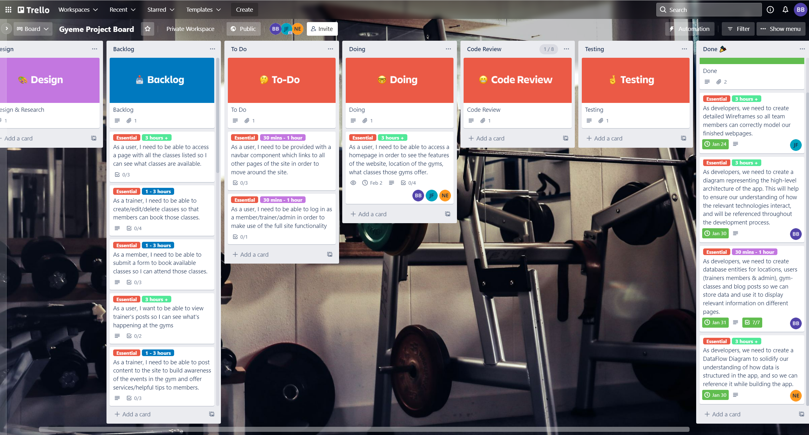

# Ben Bartholomew T3A2-A

## R1 - Website Description
Our application is for a Gyeme Fitness Clubs, which is a meme-themed gym, currently with three locations, and will facilitate trainers working at the gym to create and manage classes, and current members to get in touch with trainers, and to sign up for existing classes.

Purpose:
To provide a platform where trainers can easily view information related to their classes as well as create, update and delete classes. As well as a platform where members can view information related to the gym and the gym’s trainers, such as contact info and qualifications, sign up for new classes and view and manage the classes for which they have already signed up.

Features:
This application will have a number of MVP features which are essential to its primary functionality and will thus be prioritized, as well as optional features to further extend its
functionality which will be added if time permits.

Essential features:
1. User Authentication: members will need to be authenticated in order to access the functionality of the app related to gym members. And gym trainers who use the app will need similar authentication for their part.
2. Authorization: the members of the gym using the app will be given different roles and permissions to the non-members. The trainers/staff using the app will also need specific permissions not accessible by the other user types, such as adding classes.
3. Display: This app will need components and pages which display information about the gym itself, such as the locations and opening hours of the clubs and the trainers at the gym, such as their classes and availability, and these will differ across the three club locations. Members will need to be able to view their own information, such as the classes they have already signed up for.
4. Notifications: Trainers will receive notifications of when members have booked their classes and members will receive notifications when they have an upcoming class.

Possible extra features:
1. Internal user messaging: a member may send messages to a trainer, in regards to classes or other gym-related events.
2. Email notifications: trainers and members may be able to receive notifications from the app through their email regarding classes and other important events.
3. Email password verification: this app will be structured such that an account is created for a member after they have signed a physical contract at an actual club; this password may be changed by the member, by verifying their email address.
4. Blog posting for trainers: trainers can upload blog posts, pictures or videos or other such things to their profile for members to view. Other trainers or members may be able to
comment on these.
5. Progress logs: members may be able to keep track of their own progress by keeping a log or journal of their exercise history or fitness goals.

Target Audience:
The target audience of this application will be the client base of the gym it is used by, which will
be primarily young adults aged 18-50, who are familiar and comfortable using the internet, but
will also be accessible by anyone looking to improve their overall health and fitness through
exercise.

Tech Stack:
This application will be built with the PERN stack. It will use PosgreSQL as its database, Node.js
and Express.js for its backend operations, and React for its front end components.

## R2 - Dataflow Diagrams
### Profile Dataflow:

### Blogs Dataflow:

### Classes Dataflow:

## R3 - Application Architecture Diagram

## R4/R6 - User Stories/Trello Screenshots
https://trello.com/b/83a5vZmT/gyeme-project-board

We have selected the Kandban planning methodology to adhere to for the duration of this project; as is visible from our trello board which uses a kanban style template. The Kanban methodology provides all team members with a transparent visual representation of the project's stage of development at all times, a way to reduce bottlenecking of features, or spending too much time on any given feature (because it limits the number of tickets in each development phase) and a way to easily edit existing tickets or add new ones. It also allows us to easily divide work between us in a flexible way.

### 21/01:

### 27/01:

### 31/01:

## R5 - Wireframes

This writeup will cover most of the meaningful pages/components of the application. Some of the forms and other re-used pages and components will be left out, since the majority of their display properties will already be covered.

### Home Page
#### Project Flow:
This page links to all other pages on the site and can be accessed at all points of the site.

#### Space distribution:
The page space is distributed such that each component holds only necessary information and directs to another more meaningful page of the site. The space distribution varies across different viewports, but all necessary actions can still be performed. This ensures the page is responsive across all devices.

The contact info of the gym is located at the bottom of the page as a footer component, rather than as a separate page, to reduce the link clicking required to use the site.

#### Content prioritisation:
The hierarchy of components can be observed as follows: the largest components of the page, locations, classes/trainers are the main points of focus for the user.

The heading and navbar at the top of the page to introduce the purpose of the page can be thought of as secondary components. The footer component at the bottom of the page can be thought of as an extra component which has its own separate hierarchy, which can be followed in order of a component’s importance, from top to bottom and from left to right.

#### Intended Actions: 
Primary purpose is to redirect to the more meaningful features of the site and introduce the user to our page. Also to display the site’s contact info and social media links and encourage a user to reach out.

#### Functions:
Can link to other parts of the website and show the gym locations, trainers and classes. Introduces the site and displays business’ contact information.

#### Relationships Between screens:
Links to all other screens, and can be easily navigated to from any other page via navbar.

### Classes Page
#### Project Flow:
This page links to all other pages on the site and can be accessed at all points of the site via navbar.

#### Space distribution:
Space is distributed differently across viewports for responsiveness. Each class is contained in a component on the page with its image as the central
subcomponent, and label and description etc as secondary subcomponents within that. These class components take the majority of the space on the web page as they are the focus of the classes page.

#### Content prioritisation:
The hierarchy of components can be observed as follows: the largest components of the page, classes are the primary targets for the user. The heading and
navbar at the top of the page to introduce the purpose of the page can be thought of as secondary components, and therefore, given less space on the page.

#### Intended Actions:
To display a nice image of a class to the user and entice them into booking the classroom contacting the trainer who hosts it. 

#### Functions:
Links to a class booking page for each class and links to the host trainer’s profile. This is primarily how members are expected to book classes.

#### Relationships Between screens:
Links to all other screens, and can be easily navigated to from any other page via navbar - navigates to a booking for a specific class and to a specific trainer profile also.

### Book/Crud Class Page
#### Project Flow:
This page is accessed via a logged in member clicking to book a specific class, if this action is taken by a non-logged in user, they are simply redirected to the login page.

#### Space distribution:
This page should be a basic and straightforward form with the most important form details easily seen and accessed - such as the class name and booking button. There are image components for styling purposes across the sides of the page on the desktop view, to better fill the space of the page.

#### Content prioritisation:
The Image and button can be thought to be the primary components of this page, then the class name would be secondary followed by the text related to the form and the link to trainer’s profile. The Components a member is expected to interact with, and look at are given the largest amount of space.

#### Intended Actions:
To enable members to book classes and view more details of a class, and trainers to edit existing classes.

#### Functions:
Links to a class booking page for each class and links to the host trainer’s profile. This is primarily how members are expected to book classes.

#### Relationships Between screens:
Has a link to the host trainers profile, redirects to classes page on submission of the form. The navbar is not present on this page.

### Trainers Page
#### Project Flow:
This page links to all other pages on the site and can be accessed at all points of the site via navbar, then directs a user to the specific trainer’s profile page - or to book one of their classes.

#### Space distribution:
Space is distributed differently across viewports for responsiveness. Each trainer is contained in a component on the page with its image as the central subcomponent, and label and description/classes they host etc as secondary subcomponents within that. These trainer components take the majority of the space on the web page as they are the focus of the trainers page.

#### Content prioritisation:
The hierarchy of components can be observed as follows: the largest components of the page, trainers are the primary targets for the user. The heading and navbar at the top of the page to introduce the purpose of the page can be thought of as secondary components, and therefore, given less space on the page. Secondary subcomponents of the trainer components are the Classes and trainer details.

#### Intended Actions:
To display a nice image of a trainer to the user and entice them into booking one of their classes or viewing their profile and getting in contact with them in some other way.

#### Functions:
Links to a trainer’s profile, links to the booking pages for the classes hosted by each trainer.

#### Relationships Between screens:
Links to all other screens, and can be easily navigated to from any other page via navbar - navigates to a booking for a specific class and to a trainer’s profile.

### Login
#### Project Flow:
This page is a simple form for which logs a user into the site: once logged in successfully - it redirects to the homepage otherwise it displays a message saying unsuccessful login. It also links to the contact page of the site to encourage non-members to schedule an appointment and create an account. For a user who is not logged in, clicking any action reserved for members redirects to this page.

#### Space distribution:
A form with image components on the sides to utilise the space of a desktop viewport. All components are spaced such that they are clear and easily accessible, with no unnecessary features happening on the page.

#### Content prioritisation:
Primary components are the Gyeme logo image which solidifies the branding of the site, and the login button. The secondary components are the form inputs. A third level component is the link to Gyeme contact page which is an encouragement for non-members to contact the business.

#### Intended Actions:
Log in existing members, and direct non-members to the contact page.

#### Functions:
Simple login form with an additional link - and styling components to help display the brand of the page.

#### Relationships Between screens:
Once logged in - redirects unlocks the reserved member actions on the site across all pages. Otherwise links to the contact page. This page is accessible through the navbar - or by performing a members-only action while not logged in.

### Blog/trainer & Blog/Global
This is an optional feature which will be built if time permits. Each trainer has a blog page which can be thought of as Blog/Trainer, this is where a trainer can create a post and edit their own details, and where a member can view the profile and posts of a specific trainer. There is also a Blog/Global, which shows all posts made by all trainers. Members and trainers can comment on posts made by trainers on either of these blog pages.

#### Project Flow:
This place is a blog for trainers to make posts - It can be accessed by all other pages and redirects to all other primary pages.

#### Space distribution:
This page is spaced differently across different viewports and for different types of users. The post creation form will be replaced with images for non-members. For smaller viewports - the comments and creation forms are handled on separate pages rather than being on the same page. The component hierarchy is as follows: The main component of the top post is the central component and it’s image/textbody is its central subcomponent. The name and display picture are secondary subcomponents - and the buttons are third level subcomponents. The secondary components on the desktop view are the heading, creation form and comments, which are separated into their own pages for smaller viewports.

#### Content prioritisation:
Primary components are given the most space on the page, such as the top post, which displays the meaningful information of the page.

#### Intended Actions:
Display trainer blog posts to members and facilitate trainers to create their own blog posts.

#### Functions:
Post creation and crud operations for trainers details, commenting on and liking posts for members and trainers. Displays the blog posts made by trainers regarding Gyeme.

#### Relationships Between screens:
Can be accessed from all pages and links to all pages via navbar. For smaller viewports, the forms and comments are given separate widows to save space.

### Notifications page
#### Project Flow:
This page shows the notifications which occur when a trainer’s class is booked by a member, or when a member/trainer has an upcoming booked/hosted class. This is navigated to by clicking the bell icon in the navbar.

#### Space distribution:
A header which introduces the purpose of the page, a table which holds the information regarding notifications spans almost the entirety of the page.

#### Content prioritisation:
Primary component is the notification table which can review and remove their notifications.

#### Intended Actions:
Provide a place where users can view notifications about things which have taken place on the site.

#### Functions:
Users can view and delete their notifications.

#### Relationships Between screens:
Can be navigated to via clicking the bell icon in the navbar, and also includes the global navbar which links to all other meaningful pages of the site.

### Admin profile creation pages
This page is where the accounts on the site are created, these accounts can either be members or trainers and their password is set here. This can be thought of as the owner of the gym making accounts for gym staff and members who have signed a contract at Gyeme.

#### Project Flow:
This page is for users with the admin role to create accounts for the Gyeme website. It shows a list of all current members and trainers and the admin may perform crud operations on these. They may also click to create a new account which will link to an account creation form.

#### Space distribution:
The Users table spans almost the entirety of the site as it is the only purpose of this page. A heading, which introduces the page and the global navbar which links the site together are also displayed at the top, where they are easy to see.

#### Content prioritisation:
A Table which displays all the members of the site is the primary omponent of this page, the header and navbar are secondary components. The create a new user is a primary subcomponent of the header area, and the user information and edit user buttons are primary subcomponents of the Users table.

#### Intended Actions:
For the admin users to be able to create member and trainer accounts for people to use the site.

#### Functions:
Displays users in a large table, and links to a form for performing crud operations on users.

#### Relationships Between screens:
Only accessible by users with the role of Admin, and can be accessed after they log in via the navbar.